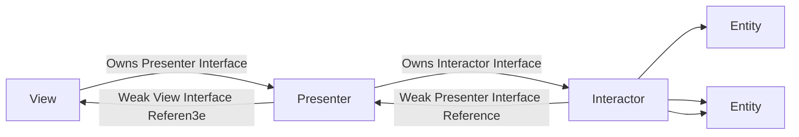

# searcherMELI
Buscador de productos

## ARQUITECTURA

### Visión general

**VIPER** es un acrónimo de **View, Interactor, Presenter, Entity y Router.** Esta arquitectura está basada en principios de responsabilidad única, que guía hacia una arquitectura más limpia, dando como resultado un proyecto mantenible, escalable y fácil de comprender.

**View.**  la responsabilidad de la vista es de enviar las acciones del usuario al presentar y enseñar lo que le dice el **Presenter.**

**Presenter**. Su responsabilidad es tomar datos desde el **Interactor** y acciones de usuario, adaptar el modelo de la vista y llevarlo hacia la **View** para mostrarlo.

**Interactor.**  Este es la columna vertebral de la aplicación, ya que contiene la lógica de negocio descrita por los casos de uso de la misma. El **Interactor** es responsable de traer datos, y su implementación es totalmente independiente de la interfaz del usuario.

**Entity.**  Contiene el modelo básico de objetos usados por el **Interactor.** Tiene parte de responsabilidades de la capa modelo en otras arquitecturas.

**Router.**  Tiene toda la lógica de navegación para describir lo que la pantalla quiere mostrar y cuando.



### NETWORKING
En la carpeta Networking/Manager se encuentran los archivos encargados de la conectividad a origenes de datos externos (Servicios REST).

Dentro de esta capreta se encuentran cada una de las implementaciones para cada caso de uso, teniendo cada una de estas la siguiente estructura:

```mermaidstrong text
Networking --> Items
Items --> API
Items --> USECASES
Items --> PROTOCOLS
Items --> ADAPTER
```

**Api:**
- En el **API** se lista cada endpoint en un enum, para cada una se define el **path** en donde está ubicada la url del servicio, el **data** en caso de necesitar información en el cuerpo del request, el **tipo de metodo** por el cual se llama al servicio (.get, .put, .post, .delete...) y **parametros** que pueda requerir el servicio en la URL por ejemplo:
**/path?parametro1=parametro1&parametro2=parametro2).**

**Adapter:** en esta carpeta se encuentran los archivos de **Adapter**  y **Session.**
- El **adapter** es el encargado de recibir los request desde los interactors y transfiere esa solicitud al session, cuando la respuesta llega al adapter, la procesa en un modelo utilizando el usecase correspondiente y lo devuelve a la instancia que lo haya solicitado.

- El **session** es el encargado de hacer el llamado al servicio por medio de su misma propiedad session la cual debe ser inyectada en el constructor, esta propiedad permite ser mockeada para realizar los UT de networking.

**Protocols:** 
- En esta se encuentra el archivo que declara las interfaces usadas por las demas clases **protocols**.

**UseCases:** 
- En los **usecases** se definen los modelos de los request que solicita un endpoint y los responses que ese mismo endpoint devuelva cuando sea llamado.


### PATRONES DE DISEÑO
El proyecto implementa algunos patrones de diseño por defecto que iOS provee por defecto:

**Delegation**
Este patrón es nativo de iOS, consiste en definir un mecanismo en el que un objeto actúa en nombre de otro o en coordinación con él. **UITableViewDelegate** Es el ejemplo más conocido de delegation que provee por defecto iOS.

**Singleton**
Singleton asegura una única instancia para cada clase y provee un punto de acceso global a esta, **UIApplication.shared o UIScreen.main** son ejemplos muy sencillos de la implementación de este patrón. VIPER implementa dicho patrón al proveer una unica instancia de cada clase (view, presenter, interactor, router) dentro de cada módulo.

**Decorator**
El patrón Decorator agrega dinámicamente comportamientos y responsabilidades a un objeto sin modificar su código. En iOS se conocen como Extensions y son muy útiles a la hora de definir algún comportamiento común.

**Observer**
Define un mecanismo de suscripción para notificar a varios objetos sobre cualquier evento que le suceda al objeto que están observando. En iOS se conocen como closures, generalmente se usan para tareas y bloques de código asíncronos, las funciones de Notification también son un ejemplo común del patrón observer. 

**Chain of responsibility**
Permite pasar solicitudes a lo largo de una cadena de manejadores. Al recibir una solicitud, cada manejador decide si la procesa o si la pasa al siguiente manejador de la cadena. VIPER aplica el patrón al pasar diferentes tipos de solicitudes entre sus capas internas hasta que una capa decide procesarla.

**Adapter**
El patrón Adapter actúa como envoltorio entre dos objetos. Atrapa las llamadas a un objeto y las transforma a un formato y una interfaz reconocible para el segundo objeto. En la capa de Netwroking para cada tipo de API se define una interfaz que permite al SessionManager manejar este objeto del tipo EndPointType.

**Facade**
Proporciona una interfaz simplificada a una biblioteca, un framework o cualquier otro grupo complejo de clases. El Adapter dentro de la capa de networking expone al interactor únicamente el llamado al endpoint con su respuesta, delegando todo el trabajo a otras clases.
